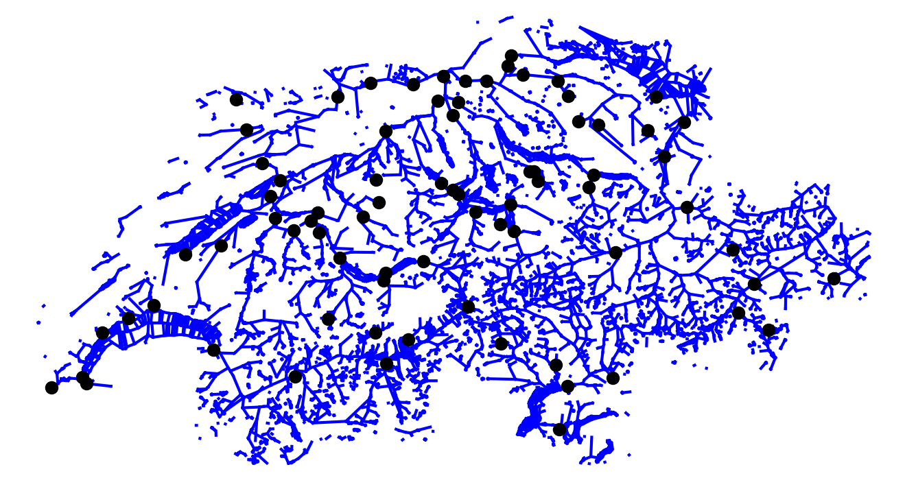

# Impute Water Temperature in the Swiss River Network using LSTMs

## The Swiss River Network

Switzerland has a ubiquitous landscape of water bodies that consists of four major rivers (Rhine, Rhône, Inn, Ticino) with their corresponding tributaries. In the high alpine regions there are glaciers, snow fields and hydroelectric power plants. Within the lowlands there is agriculture, a multitude of medium and large cities as well as various lakes. All this substantially influences the water network and especially the temperature of the water bodies.

Figure 1: Overview of the Swiss River Network. Blue lines indicate bodies of water. 81 water stations measure the water temperature (black dots).

## Missing Data
Sensor failure, scheduled maintenance or problems in the communication system are common causes for missing data in real world applications. In our particular application, dirt can clog the tube where the temperature sensor is placed in. Furthermore, temperature sensors are affected by drift and have to be calibrated regularly. A special case of missing data in our case is the time before construction of the water station: the water has been there but was not measured.

.png)
Figure 2: The distribution of gaps of different length in the water temperature data from 1980 to 2021 of the Swiss River Network. Overall, 30\% of the data is missing.

Compared to related water temperature tasks, like water temperature prediction, we have in our setting access to data before the gap, after the gap and auxiliary variables during the gap (air temperature, water discharge and the temperature of neighboring water stations).

## Method
In order to close the gaps, the first method to use is Interpolation. The methods Pr2Gap and PrPo2Gap are based on LSTM extrapolation of the water temperature. Methods A2Gap and PrA2Gap are based on a SOTA Prediction model using another variable like the air temperature. Our methods, 6 and 7, proposes to add neighboring measurements as well. If the method start with Pr we use data prior to the gap to encode the context.

Figure 3: Methods and Available data to close a gap.

## Experiment and Results
We select sequences of 90 days and introduce water temperature gaps of 2, 10, 30, and 60 days in the middle of each sequence. We split the sequences into disjoint sets for training, validation and testing. For each method and station we run a grid search. The presented results are obtained on the untouched test set sequences, measured by $\textrm{RMSE} = \sqrt{\frac{1}{n}\sum^n_{i=1}(y_i-\hat{y}_i)^2}$.

Figure 4: RMSE of the 8 different methods at 55 water stations. The result are from the unseen test set with gaps of 60 days. For 60 days Interpolation does not work suitable anymore. We suggest to use other methods. Prediction based models achieve a reasonable RMSE. By adding the connectivity information of the graph structure we further improve the RMSE.

[back](./)

