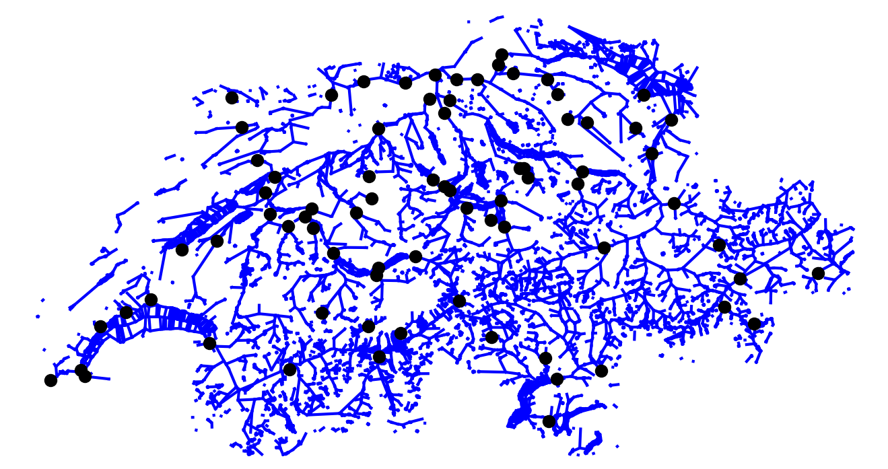

# Overview

We push the research on water temperature modeling to the new era of deep learning.

## Graph Based Approach

Compared to existing methods, our focus is on connecting and combining all water stations in Switzerland:

## Goal

We want to explore the most recent methods on various water temperature related tasks like:

  * Water Temperature Prediction
  * Water Temperature Imputing
  * Water Temperature Pattern Recognition

## Progress

We have novel contributions and state-of-the-art results in air based water temperature modeling. Some are based on graphlets and can be used for imputing missing data and forecasting. Others do not require any structure at all rendering them more flexible to broader applications.

Check out for more details under [Publications](/publications).

## Contribute

We make our work available for Bachelor and Master theses.

Research institutions are welcome to contact us in order to access the latest code and data.

## Contact
Benjamin Fankhauser ([benjamin.fankhauser@unibe.ch](mailto:benjamin.fankhauser@unibe.ch)) - University of Bern  

